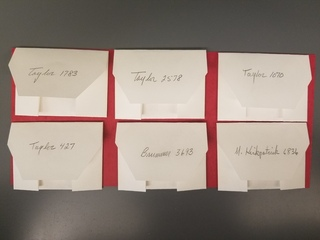

<style>

slide.backdrop {
  background: black;
}
body {
  background-color: black;
}
h2 { 
text-align: right;
 color: #4E2A84;		
}
h3 { 
 color: #3399ff;		
}

</style>

```{r setup, include=FALSE}
knitr::opts_chunk$set(echo = FALSE)
```


## Overview

1 | background  

2 | questions  

3 | approaches  

4 | methods  

5 | results  

6 | future  

7 | conclusions  


## Team 

-  Emily J. Woodworth (pollen morphology, and microscopy)
-  Jane Ogilvie (ecological fieldwork)
-  Sophie Taddeo (supervisory geospatial statistician)
-  Paul CaraDonna (big picture(s,) and little bees)
-  Jeremie Fant (all things molecular and tied together)

*i.e.* an in-house production. 

## the world is big - 1.1

## ... *really really* big - 1.2

## funding opportunties - 1.3

*haha made you look*

## sample the planet - 1.4

<div class="columns-2">
  - Bullet 1
  - Bullet 2
  - Bullet 3
  
  
</div>


## from and back to functional forms - 1.5

## plant species in ecology - 1.6

<div class="columns-2">
  - Bullet 1
  - Bullet 2
  - Bullet 3
  
  
</div>


## insects species in ecology - 1.7

## from organisms to interactions - 1.8

<div class="columns-2">
  - Bullet 1
  - Bullet 2
  - Bullet 3
  
  
</div>


## pollen records - 1.9

## metabarcoding - 1.10 

## old barcodes - 1.11

## new barcodes? - 1.12

## angiosperms 353  - 1.13

## 2 - questions  

## a353 as barcodes? - 2.1

## serverless genomics? - 2.2 

## time and species rich clades - 2.3

## are a353 semi-quantitative? - 2.4

## are floral visitation and pollen records congruent? - 2.5

## 3 -  approaches 

## Flora free data - 3.1

<div class="columns-2">
  - Bullet 1
  - Bullet 2
  - Bullet 3
  
  
</div>

## Flora free data; space - 3.1.1

## Flora free data; time - 3.1.2

## custom sequence databases - 3.2

## identify pollen grains - 3.3

## queen bee pollen loads - 3.4

## 4 - methods  

<div class="columns-2">
  
  
  - <div class = "yellow"> field work  </div>
  - <div class = "orange1"> spatial  </div>
  - temporal  
  - morphologic  
  - laboratory  
  - bioinformatic  
  - post-classification  
</div>


## study system & field work - 4.1

PICTURE OF RMBL 

## pollen morphological identification 4.2

<div class="columns-2">
  - Bullet 1
  - Bullet 2
  - Bullet 3
  
  
</div>

## pollen reference library 4.2.1

PICTURE OF POLLEN SLIDES FORM EMILY PRESENTATION

## pollen corbiculae loads 4.2.2

<div class="columns-2">

  - Bullet 1
  - Bullet 2
  - Bullet 3
  
  
</div>

## molecular barcoding 4.3

## spatial analysis 4.3.1

## plant species for distribution modelling 4.3.1.1.

LINEAR REGRESSION IMAGE

## species distribution modelling - 4.3.1.2

FULL STACK PICTURE

## sdm evaluations - 4.3.1.2

LINEAR REGRESSION

## temporal modelling - 4.3.2


## temporal modelling subset - 4.3.2.1

SPATIAL SUBSET PICTURE

## temporal modelling distributions - 4.3.2.2

WEIBULL PICTURE ?

##  barcode references library - 4.4

## genomics work - 4.4.1

<div class="columns-2">
  - Bullet 1
  - Bullet 2
  - Bullet 3
  
  
</div>

## plant genomic reference dna - 4.4.2

<div class="columns-2">
  - Bullet 1
  - Bullet 2
  - Bullet 3
  
  
</div>

## pollen genomics dna - 4.4.3

<div class="columns-2">
  - Bullet 1
  - Bullet 2
  - Bullet 3
  
  
</div>

## barcoding informatics - 4.4.4

IMAGE OF COMPUTER BUILDING

## metabarcoding - 4.5


## sequence database generation - 4.5.1


## sequence assignment - 4.5.2


## semi-quantitative evidence 4.5.3


## 5 | results  

## species distribution modelling - 4.2

OVERALL TABLE 

## sdm evaluations - 5.3

COMPARISION BY PLOT

## coarse phenological modelling - 5.4

REGRESSION COMPARISIONS

## metabarcoding - 5.5

## sequence database generation - 5.6


## sequence assignment - 5.7

## semi-quantitative evidence - 5.8


## 6 | Discussion

## 7 | future  

## new data sets? | 7.1

- artificial pollen loads
- Gunnison Sage-Grouse scat

## novel approaches | 7.2

- searching for variable loci
- flanking regions

## 8 | conclusions  

promising

## acknowledgements

two super fantastic technicians for the field seasons I worked during school, made my life SO easy

- Dani Yashinowitz (Yellowstone National Park, botanist & crew lead, Whitebark Pine Surveys)
- Hannah Lovell (Telluride Mountain Resort, and ISO work)


## acknowledgments

Sam Isham, Kelly McMillen, 

