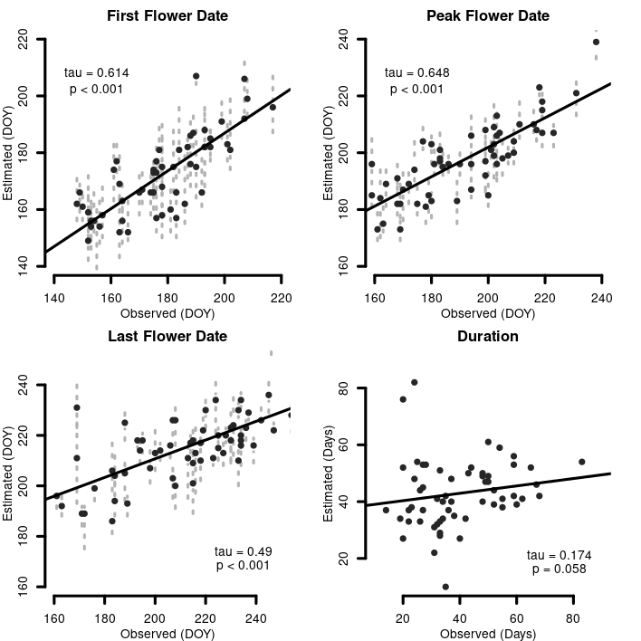

<style>

slide.backdrop {
  background: black;
}

h2 { 
text-align: right;
 color: #4E2A84;		
}

h3 { 
 color: #3399ff;		
}

</style>


```{r setup, include=FALSE}
knitr::opts_chunk$set(echo = FALSE)
knitr::opts_chunk$set(message  = FALSE)
knitr::opts_chunk$set(warning = FALSE)
```

```{r}
library(tidyverse)
```


## Overview

<div class="columns-2">

  <font color="black"> 1 </font> | background  

  <font color="black"> 2 </font> | questions  

  <font color="black"> 3 </font> | approaches  

  <font color="black"> 4 </font> | methods  

  <font color="black"> 5 </font> | results  

  <font color="black"> 6 </font> | future  

  <font color="black"> 7 </font> | conclusions  
  
  <center> 
  
  </center>
  
</div>

## Team {.flexbox .vcenter}

<font color="black"> Jane Ogilvie </font> *(ecological fieldwork, design)*  

<font color="black"> Emily J. Woodworth </font> *(pollen morphology, and microscopy)*  

<font color="black"> Sophie Taddeo </font>  *(geo-spatial, statistics)*  

<font color="black"> Paul CaraDonna </font> *(little bees/big picture(s))*  

<font color="black"> Jeremie Fant </font> *(all things molecular and tied together)*  

*i.e.* an in-house production. 

## the world is big - 1.1


## ... *really really* big - 1.2

<div class="columns-2">
  - 5 sampling seasons (May - October)
  - 3 person crews
  - 2 partial support personnel
  - 281 plots
  - area of inference: ~ 900,000 acres 
  - 0.363% of Bureau of Land Management administered land
  
  
  {height=85%, width=85%}
</div>

## funding opportunties - 1.3


## how do we sample the planet? - 1.4


## plant species in ecology - 1.6

<div class="columns-2">
  - mis-identification is *very* common
  - mis-identification can lead to nebulous understandings
  - mis-identification can lead to mis-management
  
  
</div>

## insects species in ecology - 1.7

- Macro Invertebrates   
  - stream ecology bio indicators  
    - mayflies, caddisflies, stoneflies  
- Coleoptera  
  - soil contamination by metal
- *from bio-indicators to foci?*
  
<center>
  
  {height=50%, width=50%}

</center>

## from organisms to interactions - 1.8

<div class="columns-2">
  - 
  - Bullet 2
  - Bullet 3
  
  {height=85%, width=85%}
</div>


## metabarcoding - 1.10 

<div class="columns-2">
  - Barcoding  
    - molecular identification of tissue from a single organism
  - Metabarcoding
    - molecular identification of organisms present in a mixed substrate
  
  {height=75%, width=75%}
</div>

<div class="notes">

Quick definition check, so barcoding is simply the identification of tissue from one organism, e.g. we could try and identify the species of Astragalus from this day of collecting via barcoding; assuming they were present in a database. 'Meta' just means we have a pooled sample to deal with, these are generally samples of soil, pollen, or water. So if we wanted to identify the assembly of organisms which are present on the rhizosphere of a species of Astragalus, we would use metabarcoding. 

</div>

## barcodes - 1.11

- Kingdom: Animal, 
  - COI (**C**ytochrome c **O**x**I**dase)
  - *holding it's own in Fungi*
- Kingdoms: Fungi + Plant 
  - ITS (**I**nteral **T**ranscribed **S**pacer)
  - *holding it's own in Fungi*
- Kingdom: Plant
  - ITS, rbcL, matK, trnH-psbA
  - *__not__ holding much of anything*

## new barcodes for plants? - 1.12

<div class="columns-2">
  - genomics
    - low cost
    - high coverage
    - PCR free?
  - reference library ?
    - old barcode library in development for nearly 20 years
    - Kew PAFTOL
  - angiosperms 353
  
  {height=50%, width=50%}
  {height=40%, width=40%}
</div>

## 2 - questions  

## scale - from plots to continents? {.flexbox .vcenter}

- many questions will be approached using two perspectives 
  - bottom up i.e. plot based data collected by Jane
  - top down i.e. computer based data generated by me
-  fine scale data serving to as ground truth to the computer generated models

## can we predict what is flowering in time & space? - 2.1
<div class="rows-2">
  - **which species are present in an area?**
  - **when are these species flowering in an area?**
  - diverse clades provide challenges for identification
  - species often diverged in ecological traits

<center>
{height=45%, width=45%}
</center>
</div>

## do a353 work as barcodes? - 2.2

<div class="columns-2"> 
  - 'universal' markers for phylogenomics
  - usable in all flowering plant clades 
  - first comprehensive genus level phylogeny of flowering plants 
  - shoot the moon; meta genomics first

  {height=85%, width=85%}
</div>

## are a353 semi-quantitative? - 2.3 {.flexbox .vcenter}

Do the number of sequence reads reflect the amount of biological material in a sample?

## 3 - approaches 

## predict what is flowering; *Time & Space* - 3.1

<div class="columns-2">
  - no longer any funding for floristics; few Floras maintained, fewer written
  - essentially no funding remains for alpha taxonomy
  - little to no funding natural history
  - how do we monitor ecological shifts under climate change?
    - geographic ranges
    - flowering time
  - __*back to the sheets!*__
  
  <center>
  {height=25%}
  </center>
</div>

## custom sequence databases; *a353 as barcodes?* - 3.2 {.flexbox .vcenter}

- reduce number of species present in database
  - reduce computational requirements
  - increase likelihood of relevant matches across loci
  - reduce false positives for semi-quantitative inference
  
## queen bee pollen loads: *a353 as barcodes?* - 3.3

<div class="columns-2">
  - DNA extracted from corbiculae loads
    - a 'pollen basket' for holding grains collected grains
  - variable in size, but generally many tens of thousands of grains

  <center>
  
  </center>
</div>

## identify pollen grains; *a353 semi-quantitative?* - 3.4

- 

## 4 - methods  

<div class="columns-2">
  {height=70%, width=70%}
  <br>
  <br>
  
  - <font color="#FFBF00"> **field work** </font> 
  - <font color="#FF5F1F"> **spatial** </font>
  - <font color="#800080"> **temporal** </font>
  - <font color='#9F2B68'> **morphologic** </font>  
  - <font color='#f6a192'> **laboratory**  </font>
  - <font color='#0000FF'> **bioinformatic**  </font>
  - <font color="#191970"> **post-classification** </font>
</div>


## study system & field work - 4.1 {data-background=../graphics/pictures/AmericanBasin.jpg size=cover, .flexbox .vcenter}

<font color="black"> 

- **six field sites**
- **visited weekly**
- **three transects for floral surveys**
- **sub-alpine parkland**
  - **wet meadow**
  - **dry meadow**
  - **aspen groves**
  
</font>

## pollen morphological identification 4.2

<div class="columns-2">
  - Develop grain reference library
  - Score traits
  - write keys
  - Emily Woodworth talk at ['Not Another Specimen'](https://2021.botanyconference.org/engine/search/index.php?func=detail&aid=924) ASPT @ Botany 2021
  
  {height=90%, width=90%}
</div>

## pollen reference library 4.2.1

<div class="columns-2">
  - ca. 110 species
  - 60 novels species added
  - ca. 1/3 of species with duplicate preparations
  - shared
  - *many more species to add to key!! (60 +, mostly un- sampled families)*
  
  
  {height=65%, width=65%}
</div>

## pollen corbiculae loads 4.2.2

<div class="columns-2">

  - aliquot from same sample used for molecular  
  - stained by fuchsin jelly with stirring
  - transects  
  - rarefaction curves 
    - richness  
    - abundance   
  
  <center>
  {height=30%, width=30%}
  </center>
</div>

## molecular barcoding 4.3 {.flexbox .vcenter}

- Angiosperms 353...

## spatial analysis 4.3.1 {.flexbox .vcenter}

- 2-stage approach  
  - 1^st^: distance search of records from museums & plot based data (e.g. Forest Service)
  - 2^nd^: species distribution modelling

## plant species, distribution modelling 4.3.1.1.

<div class="columns-2">

  - develop a candidate species list for barcoding  
  - download all herbarium records from a distance exceeding the study area
  - compare to known species at field site
  - logistic regression
  - bootstrapped samples of records
  
  {height=105%, width=105%}

</div>

<div class="notes">


</div>

## species distribution modelling - 4.3.1.2

<div class="columns-2">
  - gather records from aggregator websites - BIEN
  - prune records and model
  - GLM & GAM, RF & boosting 
  - ensemble individual models
  - [talk for analytical toolkit (PBC 470)](https://github.com/sagesteppe/Analytical_Toolkit_SDM)
  
  
</div>

## sdm evaluations - 4.3.1.2

- in pipeline, True skill statistics
  - works well over wide range of occurrence records

## temporal modelling - 4.3.2

<div class="columns-2">
  - reduce herbarium records to study domain
  - thin records to analogous ecoregions
  - trim start/end records
  - identify major phenological cues, subset records to similar areas


</div>

## temporal modelling subset - 4.3.2.1

SPATIAL SUBSET PICTURE

## temporal modelling distributions - 4.3.2.2

<center>
```{r}
curve(dweibull(x, shape = 2, scale = 1), from=0, to=4, ylab = 'Density',
      main = 'Weibull distribution', col = '#ff006e', lwd = 2)
curve(dweibull(x, shape = 1.6, scale = 1),  lwd = 2,  from = 0, to = 4, col = '#2a9d8f', add = T)
curve(dweibull(x, shape = 1.8, scale = 1),  lwd = 2, from = 0, to = 4, col = '#f4a261', add = T)
legend(2, .8, legend=c("shape = 2.0 & scale = 1", 
                       "shape = 1.6 & scale = 1", 
                       "shape = 1.8 & scale = 1"),
       col=c("#ff006e", "#2a9d8f", '#f4a261'),
       lty=1, cex=1.2, lwd = 2)
```
</center>
##  barcode references library - 4.4

## genomics work - 4.4.1

<div class="columns-2">
  - Plant Reference Library  
    - herbarium & silica dried  
    - CTAB, some DNEasy 
  - Pollen Extraction  
    - 'novel' CTAB / SDS extraction
  - Both
    - clean up Cytiza, size selection SPRI  
    - enzymatic fragmentation  
  
  {height=90%, width=90%}
</div>

## plant genomic reference dna - 4.4.2

<div class="rows-2">
  - 38 species to sequencing
  - 13 species duplicate
  - 24 silica gel dried, 14 herbarium leaf tissue (RM, ID, IDS)
  
  <center>
  {height=50%, width=50%}
  </center>

</div>

## pollen genomics dna - 4.4.3

<div class="columns-2">  
  - 54 Initial samples for extraction  
  - 44 samples underwent all steps and were analyses
  
  
</div>

<div class="notes">

</div>


## barcoding informatics - 4.4.4

<div class="columns-2">  
  - trimmomatic, remove tags, select sequences > 31 bp in length
  - Kraken - qualitative identification
  - Bracken - quantitative identification
  - BLAST followup
  
  {height=90%, width=90%}
</div>

## metabarcoding - 4.5


## sequence database generation - 4.5.1

<div class="columns-2">
  - Kew Tree of Life ~ ### taxa
  - US ~ xx TAXA
  
</div>

## sequence assignment - 4.5.2

<div class="columns-2">
  - initial BLAST query
  - removal of proxy species from DB, and insertion of local species
  - filter matches based on flowering phenology
  - one big function in an order of operations ('algo')
  
  
</div>


## semi-quantitative evidence 4.5.3

stuff

## 5 | results  

## field work

<div class="columns-2">
  - 723 floral visitation observations (!)
  - 36 unique plant species involved
  - 64 corbiculae loads from Queens
  
  
  
</div>

<div class="notes">


</div>

## sdm candidate species ????

<div class="columns-2">
  - downloaded some 112k records
  - mostly trees from forestry surveys
  - bootstrap re-sampled to reduce effects of collection 'hotspots'
  - non-present taxa begin nearly immediately...
  - real occurrences taper off quickly
  
  {height=90%, width=90%}
</div>

## sdm evaluations - computational - 5.2

```{r}
dat <- read.csv('../data/evaluation_table.csv')[,2:3]
data.frame(Metric  = dat[1:5,1],
                   Value   = dat[1:5,2],
                   Metric1 = dat[6:10,1],
                   Value1  = dat[6:10,2]
                   ) %>% 
  knitr::kable(caption = "Logistic regression assessing accuracy of SDMs; witheld data",
    col.names = c('Metric', 'Value', 'Metric', 'Value'),
    booktabs = T)
```


<div class="notes">

Species distribution models are hypothesis which require testing. The values in these tables arise from the practice of taking 70% of occurrence records and using them for training, and using the remaining 30% of records for testing. All of these results arise from testing an equal number of presences and absences from the final ensembled models. From the results you can see that we focused on REMOVING more species from the pools generated via logistic regression and distance searches (TRUE NEGATIVE RATE), than we did on identifying presences. Overall results were very good, and were generally highly comparable to model performances achieved by persons focusing on modelling individual species. 

</div>

## sdm evaluations - 5.3.1


|           |     ml     |    lm      |
|:---------:|:----------:|:----------:|
| ensembles |      493   |      473   |
|   true +  |      362   |      286   | 
|   true -  |       33   |       55   |
|  false +  |       64   |       41   |
|  false -  |       34   |       93   |
  

<div class="notes">

So we were able to make somewhat of a comparison to a vascular plant checklist for the field site as a whole. The checklist is of, a distinct quality in regards to those endeavors, and no records contain noted vouchered accessions, no effort was made to assure the identity of any determinations in the herbarium, and many species records are anecdotal. 

Further we did intentionally want to remove a great many of the records from this list, which contained for example many alpine species. So it is not a great reference, but we see that by combining the focal search from location with SD modelling we were able to identify the presence of many taxa. 

</div>

## sdm evaluations - 5.3.2

- We were interested in comparison to the Valleys. 
- Plot Level, 117 species total (109 eligible for modelling...)
  - ML: 105 (89.7% (96.3%))  
  - LM: 102 (87.2% (93.5%))
- Able to detect virtually all species recorded on plot
  
<div class="notes">

Finally, we could compare our models in a very tangible and direct way. We compared them to the plot level data from the plots. While these data were not comprehensive, and hence could not be used to evaluate absences, nor full floristic composition - we were able to predict the presence of nearly every single species encountered on each plot. The only taxa which we missed, which were not 'restricted' from the initial database we used to access occurrence records, were missed simply due to taxonomic inconsistences. 

As the goal of the sdm's were to predict a relevant candidate list of species which are present in an area for developement of the database. I believe these are very successful results. 

</div>

## coarse phenological modelling - 5.4.1

<div class="columns-2">
  - strong agreement between first and peak flower periods with historic data
  - good agreement between last flower date 
  - *no* agreement with duration! - species do not 'line up'
  
  {height=92%, width=92%}
</div>

<div class="notes">

The computational data aligned well with what has been observed on the ground over long term periods for two calculations. There was very good agreement between first and peak flower date, and good agreement with last flower date. We were unable to emulate the observations of duration. This indicates that we may not have the best data for each individual species, but perhaps rather them as an amalgamation. 

</div>

## coarse phenological modelling - 5.4.2

<center>
<div class="rows-2">
  - similar results with weekly data across *all* field sites combined
  - tau values lower than over longer term data
  <br>
  <br>
  <br>
  <br>
  
  {height=50%, width=50%}
</div>
</center>

<div class="notes">

Results were pretty much the same between the field collected data and computationally derived data. We were not able to calculate peak flower date due to methodological differences. We did not calculate duration as we knew this method does not perform well in that capacity. 

</div>

## metabarcoding - 5.5

## sequence database generation - 5.6

<div class="columns-2">
  - found existing data for 130 species on NCBI - SRA
  - novel sequence data for 25 species, varying number of loci
  - whole 'ring' to be completed within the year

  {height=90%, width=90%}

</div>

<div class="notes">

We were not able to establish a database with nearly as much data as we hoped to. Kew was meant to have released the full 14k species worth of data already, but then COVID. Nonetheless, we had pretty good coverage for our purposes. We were able to establish a database of 155 species. We expect around the time this work is published, KEW will have released the remainder of these data. 

</div>

## sequence assignment - 5.7 - I

<div class="columns-2">
  - trimmomatic (discard short reads)  
  - Kraken (many false positives)
  - Bracken  (many *many* false positives)
  - Blast  (fewest false positives)

  {height=93%, width=93%}
</div>

<div class="notes">

We utilized trimmomatic to trim unique identifiers which are attached to all samples for metagenomic sequencing, which have been shown to give false positives, and to remove short reads when we were at it. Essentially Kraken requires reads at least 30 base pairs long and these were removed at this stage. We initially planned on using a single algorithm for classifying our sequence reads. Kraken, kraken is a very fast sequence alignment algorithm which has enormous popularity in the microbiome world, and the application of metagenomics there. 

Subsequent to Kraken, which will classify reads to the lowest unambiguous taxon which it can, i.e. it can return matches for 'Rosaceae'. Bracken 'Bayesian Reestimation of Abundance with KrakEN', is an extension of kraken which seeks to classify all reads from higher to a terminal taxon. It also is supposedly quite good at estimating abundances of reads in samples. We found that while Bracken would place all results, we were very skeptical of them. 

Accordingly, we decided to give BLAST, the golden standard of sequence alignments a go. We aligned all sequences which were used by Kraken, so essentially kraken became an intermediate filter, to BLAST. we were considerably happier with the results from Blast being closer to what field data told us. 

</div>

## sequence assignment - 5.7 - II

```{r}
pp_seqs_t <- read.csv( file.path('../data', 'Sequence_Reclass_table.csv') ) %>% 
  mutate(across(where(is.numeric), ~ round(.x, 1)))

knitr::kable(pp_seqs_t, align = "c", 
             col.names = c('Condition', 'No. Class.', 'Prcnt. Class.', 'Total Seqs', 'Rank'),
             caption = "Post classification of Sequences via Taxonomy and Ecology,\ntop 15 most abundant reads") %>% 
  kableExtra::kable_styling(
      latex_options = "striped",
      stripe_color = "gray!10")
```


<div class="columns-2">

<div class="notes">

The number of taxa matched in any one corbiculae loads were capped at the top 15 identifications. Using the automated sequence reclassification schema, roughly 55% of taxonomic records, and 50% of all BLAST classified sequences were moved to a species believed present and flowering at the field station on the date the sample was collected. Roughly 42% of all taxonomic records, and 49% of all blast classified sequences were to be blunt probably wrong, and could only be placed to the level of genus. 

</div>

## sequence assingment - 5.7 - III

<div class="columns-2">

  - Naive BLAST from custom databases 26% accuracy
  - post-classified BLAST using temporal filters to create genera monogeneric in space and time 44%
  - BLAST, creates *many* false positives
  
  {height=95%, width=95%}

</div>

## sequence assingment - 5.7 - IV

<div class="columns-2">

  - conceptually similar to the automated process
  - utilized high resolution occurrence and phenology data
  - utilized morphological and molecular data
  - no linear operation or rule of precedence
  - classified all sequences to species

</div>

<div class="columns-2">

<div class="notes">

OK so, via automatic processes, and with coarser resolution we were missing a species identification for 50% of our reads. But when we have finer scale data, we can actually also classify those reads, and reconsider the reads previously classified via the other processes. 

What is very exciting about this, is this is basically the best insight that we can get from a experts at a field station, and we can readily compare it to the best insights which we could hope to glean from wider expanses of land. 

</div>

## semi-quantitative evidence - 5.8

<div class="columns-2">
  - info
  - *some* relationship exists
  - requires further work by someone else
  
  {height=90%, width=90%}

</div>

<div class="notes">

Alright we did use these data in the last step. SO some relationship exists here, which seems as promising or honestly more promising than exists for the older barcodes. We did not have much to investigate this, but it warrants investigations. 

</div>


## final floral feeding structure - 5.9

less stuff

##  Discussion - 6

stuff 

## conservation implications - 6.1

- a hidden plain text paragraph in the discussion.
- collaboration with Ken Holsinger, Jedd Sondergard @ BLM Montrose

<div class="notes">

I work for the Bureau of Land Management Field office immediately adjacent to this field station. And i have been writing a lot of reports, and I decided to sneak in a paragraph that I would be able to cite in multiple contexts, and which would be readily interpretable to land management professionals. So I am working with my boss and his co-worked to refine and formulate a paragraph like this based on how to fix these. 

</div>


## conservation implications - 6.1 - II

<div class="columns-2">

  - historic vegetation treatment removals  
    - *Delphinium*, *Astragalus* & *Oxytropis*  
  - altered fire cycle  
    - *Delphinium*, *Mertensia*  
  - stream channelization / wetland removal  
    - *Mertensia*  
  - seed species, where missing
  - allow return of historic fire cycle,
  - reintroduce beavers  

  
</div>

## 7 | future  

## metabarcoding; computational approaches - 7.2

<div class="columns-2">

- qualitative:
  - search for variable loci
  - flanking regions and pop gen
  <br>
  <br>
  
- quantitative:
  - read re-assignment based on phylogentic distance
  - read re-assignment in bayesian framework

</div>

<div class="notes">

it seems that future uses of t

</div>

  
## metabarcoding;  new data sets? - 7.1 {.flexbox .vcenter}

<div class="rows-2">
  - artificial mixtures  
    - leaf tissue  (counted cells)
    - pollen loads  (counted grains)
  - Gunnison Sage-Grouse scat
    - BLM habitat assessment data
    - opportunistic collections
  
  
  
</div>

## bombus; trends in perennial bunchgrasses - 7.3

- notable declines in bunch grasses over the last 40 years
- especially pronounced in montane areas
- model conversion of meadows/Aspen stands to conifer forest
- use existing data to model reductions in grass cover
- view historic grazing renewals to monitor (loosely) reduction in grass diversity
- forked from Ken Holsinger

## 8 | conclusions  

promising

## acknowledgements

<div class="columns-2">

  - Dani Yashinowitz B.S. SUNY (Yellowstone National Park, botanist & crew lead, Whitebark Pine Surveys (!!!))
  - Hannah Lovell B.S. DU (Telluride Mountain Resort, and in search of work!!)
  
  


</div>

<div class="notes">

two super fantastic technicians for the field seasons I worked during school, made my life SO easy   
find them funding and recruit them, and then give me a finders fee.  

</div>

## acknowledgments

Employment: Yingying Xie (NU), Josh Scholl (NU), Sam Isham (UM), Kelly McMillen (UM), Kay Hajek (UM), Linda Vance (UM), Cassandra Owen (SCC), Ken Holsinger (BLM)

Project: Nyree Zerega, Pat Herendeen, Hilary Noble, Zoe Diaz-Martinez, Angela McDonnell, Elena Loke, Ian Breckheimer, Ben Legler, Ernie Nelson, Charles (Rick) Williams, D. Knoke, L. Brummer, J. Boyd, C. Davidson, I. Gilman, M. Kirkpatrick, S. McCauley, J. Smith, K. Taylor, & C. Williams. David Giblin, Mare Nazaire, Sarah Burnett, Lauren Price, T.C.H. Cole, Eliot Gardner. 
