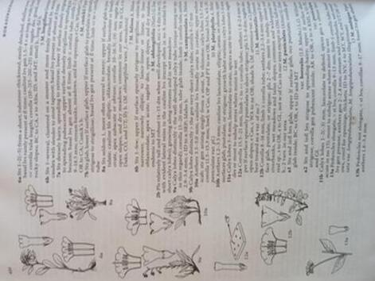

<style>

slide.title-slide h1 {
  font-size: 2.0em;
  line-height: 1.5;
}

slide.title-slide h2 {
  font-size: 1.0em;
  text-align: left;
  color: #4E2A84;		
  line-height: 1.2;
}

slide.backdrop {
  background: black;
}

h2 { 
text-align: right;
 color: #4E2A84;		
}

h3 { 
 color: #3399ff;		
}

</style>


```{r setup, include=FALSE}
knitr::opts_chunk$set(echo = FALSE)
knitr::opts_chunk$set(message  = FALSE)
knitr::opts_chunk$set(warning = FALSE)
```

```{r}
library(tidyverse)
```


## Overview

<div class="columns-2">

  <font color="black"> 1 </font> | background  

  <font color="black"> 2 </font> | questions  

  <font color="black"> 3 </font> | approaches  

  <font color="black"> 4 </font> | methods  

  <font color="black"> 5 </font> | results  

  <font color="black"> 6 </font> | future  
  
  <center> 
  
  </center>
  
</div>

## Team {.flexbox .vcenter}

<font color="black"> Jane Ogilvie </font> *(ecological fieldwork, design)*  

<font color="black"> Emily J. Woodworth </font> *(pollen morphology, and microscopy)*  

<font color="black"> Sophie Taddeo </font>  *(geo-spatial, statistics)*  

<font color="black"> Paul CaraDonna </font> *(little bees/big picture(s))*  

<font color="black"> Jeremie Fant </font> *(all things molecular and tied together)*  

*i.e.* an in-house production. 

## the world is big - 1.1

<div class="columns-2">
  
  
 
  - time to see 1/2 the flora of North America N of mexico in the field
  - a decade ~ 5 years worth of actual fieldwork
  - 12 states
  - this is all!!!!
</div>

## ... *really really* big - 1.2

<div class="columns-2">
  - area of inference: ~ 900,000 acres 
  - 281 plots
  - 5 sampling seasons (May - October)
  - 3 person crews
  - 2 partial support personnel
  - 0.363% of Bureau of Land Management administered land
  
  
  {height=85%, width=85%}
</div>

## funding opportunties - 1.3


## plant species in ecology - 1.4

<div class="columns-2">
  - very few persons with formal training in plant taxonomy / systematics
  - mis-identification is *very* common
  - mis-identification can lead to nebulous understandings
  - mis-identification can lead to mis-management
  
  
</div>

## insects species in ecology - 1.5

- Macro Invertebrates   
  - stream ecology bio indicators  
    - mayflies, caddisflies, stoneflies  
- Coleoptera  
  - soil contamination by metal
- *from bio-indicators to foci?*
  
<center>
  
  {height=50%, width=50%}

</center>

## from organisms to interactions - 1.6

<div class="columns-2">
  - often interested in the interactions between organisms
  - vary in time
  - vary in space
  - can we go from documenting species to the interaction of species?
  
  {height=85%, width=85%}
</div>


## metabarcoding - 1.7

<div class="columns-2">
  - Barcoding  
    - molecular identification of tissue from a single organism
  - Metabarcoding
    - molecular identification of organisms present in a mixed substrate
  
  {height=75%, width=75%}
</div>

<div class="notes">
Quick definition check, so barcoding is simply the identification of tissue from one organism, e.g. we could try and identify the species of Astragalus from this day of collecting via barcoding; assuming they were present in a database. 'Meta' just means we have a pooled sample to deal with, these are generally samples of soil, pollen, or water. So if we wanted to identify the assembly of organisms which are present on the rhizosphere of a species of Astragalus, we would use metabarcoding. 
</div>

## barcodes - 1.8

- Kingdom: Animal, 
  - COI (**C**ytochrome c **O**x**I**dase)
  - *holding it's own in animals*
- Kingdoms: Fungi + Plant 
  - ITS (**I**nteral **T**ranscribed **S**pacer)
  - *holding it's own in Fungi*
- Kingdom: Plant
  - ITS, rbcL, matK, trnH-psbA
  - *__not__ holding much of anything*

## new barcodes for plants? - 1.9

<div class="columns-2">
  - genomics
    - low cost
    - high coverage
    - PCR free?
  - reference library ?
    - old barcode library in development for nearly 20 years
    - Kew PAFTOL
  - angiosperms 353
  
  {height=53%, width=53%}
  {height=45%, width=45%}

</div>

## <font color="black"> questions - 2 </font> {data-background=../graphics/pictures/Angelica_capitellata.resized.jpg size=cover, .flexbox .vcenter}

<div class="notes">
So the questions we sought to determine an answer to all centered around the utility of these probes as barcodes. We pretty much shot the moon here, and skipped a lot of validation testing, which now others are catching up with. We largely utilized kind of two approaches here to answer the questions we had.
</div>

## scale - from plots to continents? {.flexbox .vcenter}

- many questions will be approached using two perspectives 
  - bottom up i.e. plot based data collected by Jane
  - top down i.e. computer based data generated by me
-  fine scale data serving to as ground truth to the computer generated models

<div class="notes">

We operated at two fronts here which is quite confusing, but essentially we had very informative high resolution ground truthed data which had been collected by Jane Ogilvie. In the spirit of the world is big, you can only collect these types of data at field stations. We wanted to see how well we could approximate a couple parameters of these data using museum records and computational approaches. 

</div>

## can we predict what is flowering in time & space? - 2.1
<div class="rows-2">
  - **which species are present in an area?**
  - **when are these species flowering in an area?**
  - diverse clades provide challenges for identification
  - species often diverged in ecological traits

<center>
{height=45%, width=45%}
</center>
</div>

<div class="notes">
So i take a very hands on approach to barcoding which is scant outside of the more botanical focused literature. You can imagine that you are out botanizing, and you are trying to key some material and you make it to a tricky couplet. You are in the field so you cannot refer to herbaria sheets nor monographs so what do you do? You turn to, what at least a contingent of field botanists refer to as the unholy alliance of ecological characteristics,  to help you identify the material. Obviously, you can start to consider:

A) which species grow in the geographic area
B) which are in similar ecological sites and 
C) which ones are flowering now? 

And you can use these as sieves to determine what it is you are likely to be looking at. This is especially useful for many of the more diverse clades, wherein many species differ in flowering time; obviously Richard Ree and many collaborators just published a beautiful paper on this in Rhododendron. 
</div>

## do a353 work as barcodes? - 2.2

<div class="columns-2"> 
  - 'universal' markers for phylogenomics
  - usable in all flowering plant clades 
  - first comprehensive genus level phylogeny of flowering plants 
  - shoot the moon; meta genomics first
  - **requires a reference sequence database**

  {height=85%, width=85%}
</div>

<div class="notes">
so the main question is, can we use Angiosperms 353 to identify unknown plant material? These probes are very promising for the reasons on the slide. 
</div>

## are a353 semi-quantitative? - 2.3 {.flexbox .vcenter}

Do the number of sequence reads reflect the amount of biological material in a sample?

<div class="notes">
quantitative is more or less the grail for barcoding, especially metabarcoding. You can find many journals that allow people to call their approaches 'quantitative' and many algorithms which claim to really be quantitative. You cannot say nor use these approaches in any journal people would consider ' prestigious'. I am not sure if analytical chemists are reviewing these papers or not, but they do not let that slide.

However, many methods have promise for being semi-quantitative. Genomics approaches in particular are very very promising to be more accurate in regards to semi-quantitative estimates than other approaches. So basically we want to create a scatter plot and see what this relationship looks like.
</div>

## <font color="black"> approaches - 3 </font> {data-background=../graphics/pictures/Gothic.jpg size=cover, .flexbox .vcenter}

## predict what is flowering; *Time & Space* - 3.1

<div class="columns-2">
  - no longer any meaningful funding for floristics; few Floras maintained, fewer written
  - essentially no funding remains for alpha taxonomy
  - little to no funding natural history
  - how do we monitor ecological shifts under climate change?
    - geographic ranges
    - flowering time
  - __*back to the sheets!*__
  
  <center>
  {height=25%}
  </center>
</div>

<div class="notes">
In order to determine which plants grew near our study sight and when they were flowering, we utilized many museum specimens. OK folks, so i worked under Obama, Trump and Biden, and funding for the basic infrastructure required to perform botany has really just been rotting away rapidly. Essentially, it is very apparent that many things that persons take for granted are going to to lose maintenance. We have been trying to prepare for this future for a while, and i deemed it essential to do so here. SO while Colorado has multiple floras, one of which is even half decent, essentially no other western states do, and I do not hesitate to consider that globally most regions are lacking what they require. 

Accordingly we tried to model two very basic pieces of information which are present in Floras. Geographically where is something, ecologically where does it grow, broadly, and when does it flower?
</div>

## custom sequence databases; *a353 as barcodes?* - 3.2 {.flexbox .vcenter}

- reduce number of species present in database
  - reduce computational requirements
  - increase likelihood of relevant matches across loci
  - reduce false positives for semi-quantitative inference
  
<div class="notes">
OK, very important to the usage of molecular barcodes is the development of a database of reference sequence which serve as library to look your sequences up in. With the old barcodes, you can put all existing loci on a computer of surprisingly small size and use it. Like there are , multiple laptops in this building which can do this.  However a353, have about 350 more possible loci per species... YOu also have to download the A353 as short reads and assemble them yourselves. 

That is not so much an option across the board. And in a year or two when the full PAFTOL release occurs, it will be a strain even on servers. SO you need to build a custom database of relevant sequences. 
</div>
  
## queen bee pollen loads: *a353 as barcodes?* - 3.3

<div class="columns-2">
  - DNA extracted from corbiculae loads
    - a 'pollen basket' for holding grains collected grains
  - variable in size, but generally many tens of thousands of grains

  <center>
  
  </center>
</div>

<div class="notes">
In order to determine if A353 worked as barcodes in metagenomic applications, we decided to see if we could determine which species are present in corbiculae loads collected from Queen Bumble Bees. Corbiculae loads can be thought of as baskets of pollen grains which a bee is going to bring back to it's nest. Jane opportunistically collected many of these in 2015. We are hence extracting and sequecing DNA from pollen grains. 
</div>

## identify pollen grains; *a353 semi-quantitative?* - 3.4

- compare number of sequence reads from barcoding to microscopy data
- develop reference library of physical pollen grains and score characters to create keys
- count number of pollen grains per morphotypes on aliquots of the corbiculae load

<div class="notes">
Generally when one is validating that barcoding methods work, they will assemble a mix of known quantities of pollen grains which they collected and unequivocally know the identity of. Some others do not do it that way. We were in camp 2. So to detect if we had semi-quantitative evidence, we had to try and determine how many grains were actually in each sample. We did some really neat morphology work, and Emily did some amazing counting work. 
</div>

## 4 - methods  

<div class="columns-2">
  {height=70%, width=70%}
  <br>
  <br>
  
  - <font color="#FFBF00"> **field work** </font> 
  - <font color="#FF5F1F"> **spatial** </font>
  - <font color="#800080"> **temporal** </font>
  - <font color='#9F2B68'> **morphologic** </font>  
  - <font color='#f6a192'> **laboratory**  </font>
  - <font color='#0000FF'> **bioinformatic**  </font>
  - <font color="#191970"> **post-classification** </font>
</div>


## study system & field work - 4.1 {data-background=../graphics/pictures/AmericanBasin.jpg size=cover, .flexbox .vcenter}

<font color="black"> 

- **six field sites**
- **visited weekly**
- **three transects for floral surveys**
- **sub-alpine parkland**
  - **wet meadow**
  - **dry meadow**
  - **aspen groves**
  
</font>

## pollen morphological identification 4.2

<div class="columns-2">
  - Develop grain reference library
  - Score traits
  - write keys
  - Emily Woodworth talk at ['Not Another Specimen'](https://2021.botanyconference.org/engine/search/index.php?func=detail&aid=924) ASPT @ Botany 2021
  
  {height=90%, width=90%}
</div>

## pollen reference library 4.2.1

<div class="columns-2">
  - ca. 110 species
  - 60 novels species added
  - ca. 1/3 of species with duplicate preparations
  - shared
  - *many more species to add to key!! (60 +, mostly un- sampled families)*
  
  
  {height=65%, width=65%}
</div>

## pollen corbiculae loads 4.2.2

<div class="columns-2">

  - aliquot from same sample used for molecular  
  - stained by fuchsin jelly with stirring
  - transects  
  - rarefaction curves 
    - richness  
    - abundance   
  
  <center>
  {height=30%, width=30%}
  </center>
</div>

## molecular barcoding 4.3 {.flexbox .vcenter}

- Angiosperms 353...

<div class="notes">
Right folks we bar-coded the pollen using angiosperms353, right it was on the cover of AJB, kinda a big deal. 
</div>

## spatial analysis 4.3.1 {.flexbox .vcenter}

- 2-stage approach  
  - 1^st^: distance search of records from museums & plot based data (e.g. Forest Service)
  - 2^nd^: species distribution modelling
  
<div class="notes">
To determine which species we would try and model, we needed to determine which species were in the area. we are able to do this using a spatial query of a database, for an area exceeding our immediate study area. We cheated, here and used the real vascular plant checklist for the field office to score positives and negatives. We then take the records which the regression indicates are more likely to be present based on distance and model those. 
</div>

## plant species, distribution modelling 4.3.1.1.

<div class="columns-2">

  - develop a candidate species list for barcoding  
  - download all herbarium records from a distance exceeding the study area
  - compare to known species at field site
  - logistic regression
  - bootstrapped samples of records
  
  {height=105%, width=105%}

</div>

<div class="notes">
As stated, we did these steps. We were able to more or less control for the effect of being at hot-spot of academic research without too much issue. 
</div>

## species distribution modelling - 4.3.1.2

<div class="columns-2">
  - gather records from 'aggregator' websites - BIEN
  - prune records and model
  - GLM & GAM, RF & boosting 
  - ensemble individual models
  - [talk for analytical toolkit (PBC 470)](https://github.com/sagesteppe/Analytical_Toolkit_SDM)
  
  
</div>

<div class="notes">
OK so to model the species distributions, we downloaded a decent number of species records from what is called an 'aggregator' website. An aggregator website is related to a database which collects digitized herbaria records and records from vegetation surveys. We then cleaned the records to do two paradigms of modelling, 'strong linear model's' and machine learning. We used two methods of each which have similar requirements in terms of ratios of presence to absence records and iterations and were accordingly easy to program. Each pair also plays to the others strengths and weaknesses. We then combined all fit models, as ensemble predictions. 
</div>

## sdm evaluations - 4.3.1.2

- in pipeline, True skill statistics
  - works well over wide range of occurrence records

<div class="notes">
while deciding the weights for which models would be included and how they would be weighed during statistical ensembling we used TSS. It has performance comparable to AUC-ROC, and some other ML diagnostics and works well over a wide range of species presences and absences.

Subsequent to creating the statistical ensemble, we extracted all of our predictions to a polygon containing our study area, and marked records where the mean of cells across the entire area encompassed by the polygon were over 50% probability, as present. 
</div>

## temporal modelling - 4.3.2

<div class="columns-2">
  - reduce herbarium records to study domain
  - thin records to analogous ecoregions
  - trim start/end records
  - identify major phenological cues, subset records to similar areas


</div>

<div class="notes">
In order to estimate the flowering period of plant species we reduced the records from our aggregator website to only those from herbaria collections. We further subset these to similar ecological sites, as which we were interested in modelling, We then prune 10% of records from both the start and end, to address the botanists race to collect the very first individual they see flowering ever. We then subset all records into a feasible temporal period, for example, no records could be collected before the 3rd quartile of average snow melt for our ecological sites of interest.
</div>

## temporal modelling distributions - 4.3.2.1

<center>
```{r}
curve(dweibull(x, shape = 2, scale = 1), from=0, to=4, ylab = 'Density',
      main = 'Weibull distribution', col = '#ff006e', lwd = 2)
curve(dweibull(x, shape = 1.6, scale = 1),  lwd = 2,  from = 0, to = 4, col = '#2a9d8f', add = T)
curve(dweibull(x, shape = 1.8, scale = 1),  lwd = 2, from = 0, to = 4, col = '#f4a261', add = T)
legend(2, .8, legend=c("shape = 2.0 & scale = 1", 
                       "shape = 1.6 & scale = 1", 
                       "shape = 1.8 & scale = 1"),
       col=c("#ff006e", "#2a9d8f", '#f4a261'),
       lty=1, cex=1.2, lwd = 2)
```
</center>

<div class="notes">
OK so this is not nearly as fancy as the species distribution models. Basically, someone posits that many phenoogical events follow the weibull distribution. We actually more or less fit a weibull distribution to our points. 
</div>

## <font color="black"> barcode references library - 4.4</font> {data-background=../graphics/pictures/Cymopterus_goodrichii.jpg size=cover, .flexbox .vcenter}

## genomic work - 4.4.1

<div class="columns-2">
  - Plant Reference Library  
    - herbarium & silica dried  
    - CTAB, some DNEasy 
  - Pollen Extraction  
    - 'novel' CTAB / SDS extraction
  - Both
    - clean up Cytiza, size selection SPRI  
    - enzymatic fragmentation  
  
  {height=90%, width=90%}
</div>

## plant genomic reference dna - 4.4.2

<div class="rows-2">
  - 38 specimens to sequencing
  - 13 species duplicate
  - 24 silica gel dried, 14 herbarium leaf tissue (RM, ID, IDS)
  
  <center>
  {height=50%, width=50%}
  </center>
</div>

<div class="notes">
We filtered the observational queen bee dataset from 2015 to search for the plants which the bees were known to interact with the most frequently. We sequenced as much of this material as we could, from a variety of sources. Largely my own collections, or tissue gifts from a couple herbaria in the Rocky Mountain West. You can see a ton of tissue here from two floristics projects adjacent to the field site. 
</div>

## pollen genomic dna - 4.4.3

<div class="columns-2">  
  - 54 Initial samples for extraction  
  - 44 samples underwent all steps and were analyses
  - novel-ish extraction method
  
  
</div>

<div class="notes">
Many samples had DNA extracted from them. A subset went through all stages, we had to use a somewhat novel extraction method for this, which is very very cheap, but had a learning curve. Our errors are recorded for those who follow. 
</div>


## barcoding informatics - 4.4.4

<div class="columns-2">  
  - trimmomatic, remove tags, select sequences > 31 bp in length
  - Kraken - qualitative identification
  - Bracken - quantitative identification
  - BLAST followup
  
  {height=90%, width=90%}
</div>

<div class="notes">
Our informatics for this largely followed this sequence of events. 
</div>

## metabarcoding - 4.5


## sequence database generation - 4.5.1 {.flexbox .vcenter}

<div class="columns-2">
  - Kew Tree of Life ~ 130 taxa
  - us ~ 30 TAXA
  
</div>

## sequence assignment - 4.5.2

<div class="columns-2">
  - initial BLAST query
  - removal of proxy species from DB, and insertion of local species
  - filter matches based on flowering phenology
  - one big function in an order of operations
  
  
</div>


## semi-quantitative evidence 4.5.3

Regress the proportion of all identifiable pollen grains in each sample against the total percent sequence reads for those morphotypes

##  <font color="black"> results - 5 </font> {data-background=../graphics/pictures/Meadow.jpg size=cover, .flexbox .vcenter}


## field work 5.1

<div class="columns-2">
  - 723 floral visitation observations (!)
  - 36 unique plant species involved
  - 64 corbiculae loads from Queens
  
  
  
</div>

<div class="notes">
OK so Jane, had what I consider to be an enormous amount of records of floral visitiations of queens bees. She opportunistically grabbed many corbiculae loads from queens as well. We treat sites as replicates here, but none the less provenance of samples is here. 
</div>

## sdm candidate species 5.2

<div class="columns-2">
  - downloaded some 112k records
  - mostly trees from forestry surveys
  - bootstrap re-sampled to reduce effects of collection 'hotspots'
  - non-present taxa begin nearly immediately...
  - real occurrences taper off quickly
  
  {height=90%, width=90%}
</div>


## sdm evaluations - computational - 5.2.1

```{r}
dat <- read.csv('../data/evaluation_table.csv')[,2:3]
data.frame(Metric  = dat[1:5,1],
                   Value   = dat[1:5,2],
                   Metric1 = dat[6:10,1],
                   Value1  = dat[6:10,2]
                   ) %>% 
  knitr::kable(caption = "Logistic regression assessing accuracy of SDMs; witheld data",
    col.names = c('Metric', 'Value', 'Metric', 'Value'),
    booktabs = T)
```


<div class="notes">

Species distribution models are hypothesis which require testing. The values in these tables arise from the practice of taking 70% of occurrence records and using them for training, and using the remaining 30% of records for testing. All of these results arise from testing an equal number of presences and absences from the final ensembled models. From the results you can see that we focused on REMOVING more species from the pools generated via logistic regression and distance searches (TRUE NEGATIVE RATE), than we did on identifying presences. Overall results were very good, and were generally highly comparable to model performances achieved by persons focusing on modelling individual species. 

</div>

## sdm evaluations - 5.3.1


|           |     ml     |    lm      |
|:---------:|:----------:|:----------:|
| ensembles |      493   |      473   |
|   true +  |      362   |      286   | 
|   true -  |       33   |       55   |
|  false +  |       64   |       41   |
|  false -  |       34   |       93   |
  

<div class="notes">

So we were able to make somewhat of a comparison to a vascular plant checklist for the field site as a whole. The checklist is of, a distinct quality in regards to those endeavors, and no records contain noted vouchered accessions, no effort was made to assure the identity of any determinations in the herbarium, and many species records are anecdotal. 

Further we did intentionally want to remove a great many of the records from this list, which contained for example many alpine species. So it is not a great reference, but we see that by combining the focal search from location with SD modelling we were able to identify the presence of many taxa. 

</div>

## sdm evaluations - 5.3.2

- We were interested in comparison to the Valleys. 
- Plot Level, 117 species total (109 eligible for modelling...)
  - ML: 105 (89.7% (96.3%))  
  - LM: 102 (87.2% (93.5%))
- Able to detect virtually all species recorded on plot
  
<div class="notes">

Finally, we could compare our models in a very tangible and direct way. We compared them to the plot level data from the plots. While these data were not comprehensive, and hence could not be used to evaluate absences, nor full floristic composition - we were able to predict the presence of nearly every single species encountered on each plot. The only taxa which we missed, which were not 'restricted' from the initial database we used to access occurrence records, were missed simply due to taxonomic inconsistences. 

As the goal of the sdm's were to predict a relevant candidate list of species which are present in an area for developement of the database. I believe these are very successful results. 

</div>

## coarse phenological modelling - 5.4.1

<div class="columns-2">
  - strong agreement between first and peak flower periods with historic data
  - good agreement between last flower date 
  - *no* agreement with duration! - species do not 'line up'
  
  {height=92%, width=92%}
</div>

<div class="notes">

The computational data aligned well with what has been observed on the ground over long term periods for two calculations. There was very good agreement between first and peak flower date, and good agreement with last flower date. We were unable to emulate the observations of duration. This indicates that we may not have the best data for each individual species, but perhaps rather them as an amalgamation. 

</div>

## coarse phenological modelling - 5.4.2

<center>
<div class="rows-2">
  - similar results with weekly data across *all* field sites combined
  - tau values lower than over longer term data
  <br>
  <br>
  <br>
  <br>
  
  {height=50%, width=50%}
</div>
</center>

<div class="notes">

Results were pretty much the same between the field collected data and computationally derived data. We were not able to calculate peak flower date due to methodological differences. We did not calculate duration as we knew this method does not perform well in that capacity. 

</div>

## metabarcoding - 5.5
 
ca. 80% of samples made it through to analysis

## sequence database generation - 5.6

<div class="columns-2">
  - found existing data for 130 species on NCBI - SRA
  - novel sequence data for 25 species, varying number of loci
  - whole 'ring' to be completed within the year

  {height=90%, width=90%}

</div>

<div class="notes">

We were not able to establish a database with nearly as much data as we hoped to. Kew was meant to have released the full 14k species worth of data already, but then COVID. Nonetheless, we had pretty good coverage for our purposes. We were able to establish a database of 155 species. We expect around the time this work is published, KEW will have released the remainder of these data. 

</div>

## sequence assignment - 5.7 - I

<div class="columns-2">
  - trimmomatic (discard short reads)  
  - Kraken (many false positives)
  - Bracken  (many *many* false positives)
  - Blast  (fewest false positives)

  {height=93%, width=93%}
</div>

<div class="notes">

We utilized trimmomatic to trim unique identifiers which are attached to all samples for metagenomic sequencing, which have been shown to give false positives, and to remove short reads when we were at it. Essentially Kraken requires reads at least 30 base pairs long and these were removed at this stage. We initially planned on using a single algorithm for classifying our sequence reads. Kraken, kraken is a very fast sequence alignment algorithm which has enormous popularity in the microbiome world, and the application of metagenomics there. 

Subsequent to Kraken, which will classify reads to the lowest unambiguous taxon which it can, i.e. it can return matches for 'Rosaceae'. Bracken 'Bayesian Reestimation of Abundance with KrakEN', is an extension of kraken which seeks to classify all reads from higher to a terminal taxon. It also is supposedly quite good at estimating abundances of reads in samples. We found that while Bracken would place all results, we were very skeptical of them. 

Accordingly, we decided to give BLAST, the golden standard of sequence alignments a go. We aligned all sequences which were used by Kraken, so essentially kraken became an intermediate filter, to BLAST. we were considerably happier with the results from Blast being closer to what field data told us. 

</div>

## sequence assignment - 5.7 - II

```{r}
pp_seqs_t <- read.csv( file.path('../data', 'Sequence_Reclass_table.csv') ) %>% 
  mutate(across(where(is.numeric), ~ round(.x, 1)))

knitr::kable(pp_seqs_t, align = "c", 
             col.names = c('Condition', 'No. Class.', 'Prcnt. Class.', 'Total Seqs', 'Rank'),
             caption = "Post classification of Sequences via Taxonomy and Ecology,\ntop 15 most abundant reads") %>% 
  kableExtra::kable_styling(
      latex_options = "striped",
      stripe_color = "gray!10")
```


<div class="columns-2">

<div class="notes">

The number of taxa matched in any one corbiculae loads were capped at the top 15 identifications. Using the automated sequence reclassification schema, roughly 55% of taxonomic records, and 50% of all BLAST classified sequences were moved to a species believed present and flowering at the field station on the date the sample was collected. Roughly 42% of all taxonomic records, and 49% of all blast classified sequences were to be blunt probably wrong, and could only be placed to the level of genus. 

</div>

## sequence assignment - 5.7 - III

<div class="columns-2">

  - Naive BLAST from custom databases 26% accuracy
  - post-classified BLAST using temporal filters to create genera monogeneric in space and time 44%
  - BLAST, creates *many* false positives
  
  {height=95%, width=95%}

</div>

<div class="notes">
OK moment of truth with a t-test, right no hiding obscuring the truth here. did all of the dang temporal modelling and the algorithm to assign reads work? Yes, we want from 26% to 44% accuracy, and really very greatly reduced the number of false positives.  
</div>

## semi-quantitative evidence - 5.6

<div class="columns-2">
  - Levels of detection
    - 1 part per 100 ~ 90%+  
    - 1 part per 1000 ~ 80%+  
    - parter per 10000 ~ 50%+  
  - *some* relationship exists
  - requires further work by someone else
  
  {height=90%, width=90%}

</div>

<div class="notes">
Alright we did use these data in the last step. SO some relationship exists here, which seems as promising or honestly more promising than exists for the older barcodes. We did not have much to investigate this, but it warrants investigations. I have a few more things to do here.  
</div>


## sequence assingment - 5.7 - IV

<div class="columns-2">

  - conceptually similar to the automated process
  - utilized high resolution occurrence and phenology data
  - utilized morphological and molecular data
  - no linear operation or rule of precedence
  - classified all sequences to species

</div>

<div class="columns-2">

<div class="notes">

OK so, via automatic processes, and with coarser resolution we were missing a species identification for 50% of our reads. But when we have finer scale data, we can actually also classify those reads, and reconsider the reads previously classified via the other processes. 

What is very exciting about this, is this is basically the best insight that we can get from a experts at a field station, and we can readily compare it to the best insights which we could hope to glean from wider expanses of land. 

</div>

## final floral feeding structure - 5.8 {data-background=../graphics/plots/Expert_Net_DRAFT.png size=cover, .flexbox .vcenter}


##  <font color="black"> **Discussion** - 6 </font> {data-background=../graphics/pictures/Marcella.jpg size=cover, .flexbox .vcenter}


## conservation implications - 6.1

- a hidden plain text paragraph in the discussion.
- collaboration with Ken Holsinger, Jedd Sondergard @ BLM Montrose

<font size="1"> 
Some foraging preferences of *Bombus*, both at this field site and across a great many localities globally emerge from this work, which reiterates the needs for land managers to maintain relatively high amounts of members of the Fabaceae, Boraginaceae, and Ranunculaceae, in Western North American montane landscapes (@goulson2005causes, @goulson2010bumblebees, @liang2021evolutionary, @bontvsutvsnaja2021bumble). Numerous historic, and some ongoing, land management practices reduce the ability of many landscapes to support stable populations of *Bombus*. Historic livestock grazing was often associated with the targeted removal of many species of plants which are known to have compounds toxic to cattle. In particular, the removal of locoweeds (Fabaceae: *Astragalus* L. & *Oxytropis* DC.) and larkspurs (Ranunculaceae: *Delphinium*) were common across public lands administered by the United States Forest Service (@ralphs1988herbicide, @aldous1919eradicating, @ralphs2003mechanism). Further actions, generally initiated by early settlers, involved the channelization and incising of streams, culling of beavers, and leaving cattle concentrated on higher order stream banks for significant periods of time, all processes which lower the water tables and reduced the extent of stream-associated [riverine] wetlands and the mesic meadows fringes which provide habitat for many species of tall *Mertensia* (Boraginaceae, e.g. *M. ciliata* Torr. G. Don.) widely distributed across Western North America, and to an extent *Delphinium barbeyi*  and many species of native *Trifolium* L. (@dahl1990wetlands, @naiman1988alteration, @belsky1999survey, @cooke1976arroyos). Fire suppression further resulted in the succession of many Aspen (*Populus tremuloides* Michx.) groves to Conifer stands, decreasing the mosaic of age structured habitats in many landscapes, adversely effects habitat for tall *Mertensia* species and several species of *Delphinium* (@brewen202176, @keane2002cascading). Finally the effects of Nitrogen deposition, especially given the West's rapidly growing population still pose adverse effects on the abundance of a variety of species of Fabaceae at Urban-Rural interfaces (see @stevens2018atmospheric, @fenn2003ecological). Current solutions to these issues, involve targeted burns, reintroduction of beavers and beaver habitat analogs, and the possibility of re-seeding a variety of 'locoweeds' and 'larkspurs' in areas now seldom used, or only used for early, grazing. The highly enthusiastic response of land managers, and homeowners, to plant *Ascelpias* L., using genetically appropriate materials, to improve Monarch Butterfly (*Danaus plexippus* L.) habitat provides an effective framework for the latter (@oberhauser2015monarchs, @basey2015producing).
</font>

<div class="notes">
I work for the Bureau of Land Management Field office immediately adjacent to this field station. And i have been writing a lot of reports, and I decided to sneak in a paragraph that I would be able to cite in multiple contexts, and which would be readily interpretable to land management professionals. So I am working with my boss and his co-worked to refine and formulate a paragraph like this based on how to fix these. 
</div>

## conservation implications - 6.1 - II

<div class="columns-2">

  - historic vegetation treatment removals  
    - *Delphinium*, *Astragalus* & *Oxytropis*  
  - altered fire cycle  
    - *Delphinium*, *Mertensia*  
  - stream channelization / wetland removal  
    - *Mertensia*  
  - seed species, where missing
  - allow return of historic fire cycle,
  - reintroduce beavers  

  
</div>

## A353 {.flexbox .vcenter}

seem pretty cool and useful, you should use them. 

## <font color="black"> future  - 7 </font> {data-background=../graphics/pictures/Pioneers.jpg size=cover, .flexbox .vcenter}

## metabarcoding; computational approaches - 7.1

<div class="columns-2">

- qualitative:
  - search for variable loci
  - flanking regions and pop gen
  <br>
  <br>
  
- quantitative:
  - read re-assignment based on phylogentic distance
  - read re-assignment in bayesian framework

</div>

<div class="notes">

SO this is like the actual really important bleeding edge of this work. People that want papers that get cited, wander here. 

</div>

  
## metabarcoding;  new data sets? - 7.2 {.flexbox .vcenter}

<div class="rows-2">
  - artificial mixtures  
    - leaf tissue  (counted cells)
    - pollen loads  (counted grains)
  - Gunnison Sage-Grouse scat
    - BLM habitat assessment data
    - opportunistic collections
  
  
  
</div>

## bombus; trends in perennial bunchgrasses - 7.3

- notable declines in bunch grasses over the last 40 years
- especially pronounced in montane areas
- model conversion of meadows/Aspen stands to conifer forest
- use existing data to model reductions in grass cover
- view historic grazing renewals to monitor (loosely) reduction in grass diversity
- forked from Ken Holsinger

promising

## acknowledgements

<div class="columns-2">

  - **Dani Yashinowitz** (Yellowstone National Park, botanist & crew lead, Whitebark Pine Surveys (!!!))
  
  {height=65%,width=65%}
  
  
  - **Hannah Lovell** (Telluride Mountain Resort, and in search of work!!)
  {height=75%,width=75%}

</div>

<div class="notes">
two super fantastic technicians for the field seasons I worked during school, made my life SO easy   
find them funding and recruit them, and then give me a finders fee.  Dani is a super fantastic and kick ass botanist forester with a bachelors from SUNY-ESF who worked West from NY through the Upper Peninsula to land in the Northern Rockies a couple seasons ago. And yes her next seasonal gig is seriously alpine surveys in Yellowstone. 

Hannah Lovell is a little longer, and is a fantastic soil scientist and landscape ecologist born and raised in Colorado, with ridiculously well developed programming skills and soil characterization and landscape evolution expertise. We are hoping to get her back to Montrose this summer, but as the magic 8 ball says 'outlook seems doubtful'
</div>

## acknowledgments

Employment: Yingying Xie (NU), Josh Scholl (NU), Ken Holsinger (BLM), Cassandra Owen (SCC), Sam Isham (UM), Kelly McMillen (UM), Kay Hajek (UM), Linda Vance (UM)

Project: Nyree Zerega, Pat Herendeen, Hilary Noble, Zoe Diaz-Martinez, Angela McDonnell, Elena Loke, Ian Breckheimer, Ben Legler, Ernie Nelson, Charles (Rick) Williams, D. Knoke, L. Brummer, J. Boyd, C. Davidson, I. Gilman, M. Kirkpatrick, S. McCauley, J. Smith, K. Taylor, & C. Williams. David Giblin, Mare Nazaire, Sarah Burnett, Lauren Price, T.C.H. Cole, Eliot Gardner. 

Personal: Dad, Mom, Amelia Litz, Melissa, Amanda, Jack, Sim, Mark, Judy & Julia, Jim & Jenny, Matt, Diane, Jim, Jimmy. 

## <font color="black"> in memoriam </font> {data-background=../graphics/pictures/Dad.jpg size=cover, .flexbox .vcenter}

## contact info {data-background=../graphics/pictures/collecting.jpg size=cover, .flexbox .vcenter}

<div style="font-size: 3rem; color: black">
github/sagesteppe
</div>
